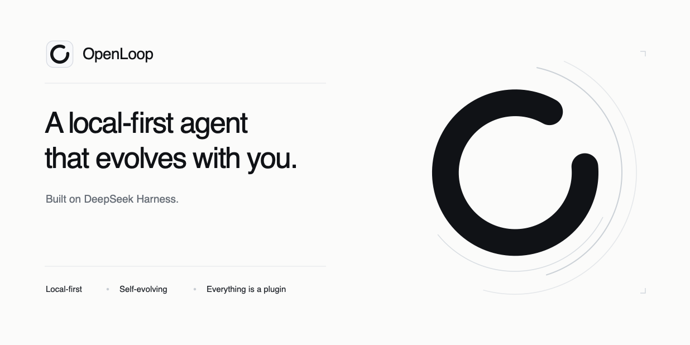

<div align="center">
  

# OpenLoop

**The local-first, extensible macOS workspace for DeepSeek Harness.**

**基于 DeepSeek Harness 的本地优先、可扩展 macOS 工作台。**


[](https://github.com/deepseek-ai/deepseek-harness)
[](LICENSE)

<br><br>



</div>

OpenLoop is an open-source macOS desktop project being built on
[DeepSeek Harness](https://github.com/deepseek-ai/deepseek-harness). It is
designed to keep DeepSeek Harness as the Agent and plugin runtime, then add the
product layer needed for daily desktop work: native lifecycle management,
model onboarding, Workspace authorization, recovery, updates, and an
extensible desktop interface.

OpenLoop 是一个正在基于
[DeepSeek Harness](https://github.com/deepseek-ai/deepseek-harness)
构建的开源 macOS 桌面项目。它将保留 DeepSeek Harness 作为 Agent 与插件运行底座，
并计划补充日常桌面工作所需的产品层：原生生命周期管理、模型配置引导、
Workspace 授权、故障恢复、应用更新，以及可扩展的桌面界面。

It is not intended to be a webpage wrapped in a window, and it will not replace
DeepSeek Harness with another Agent framework. OpenLoop aims to turn DSH into a
desktop workspace where conversations, tools, files, web content, and editable
artifacts can remain connected.

它的目标不是简单地把网页装进窗口，也不会用另一套 Agent 框架替换 DeepSeek
Harness。OpenLoop 要把 DSH 变成一个桌面工作环境，让对话、工具、文件、网页和可
继续编辑的产物保持连接。

- **Local-first / 本地优先**: Sessions, configuration, recovery state, and
  Workspace metadata stay on the Mac by default. Cloud model requests are sent
  only to providers explicitly configured by the user.<br>
  会话、配置、恢复状态和 Workspace 元数据默认保存在 Mac 本机；云端模型请求只会
  发送给用户主动配置的供应商。
- **Everything remains a plugin / 延续一切皆插件**: DSH Cordis remains the
  only plugin runtime. OpenLoop adds desktop governance instead of inventing a
  second plugin engine.<br>
  DSH Cordis 仍是唯一插件运行机制。OpenLoop 增加桌面治理，不另建第二套插件引擎。
- **Model-agnostic / 模型中立**: Built-in provider presets and custom
  endpoints keep the client independent from any single model vendor.<br>
  通过内置供应商预设和自定义端点，客户端不绑定任何一家模型厂商。
- **Designed to evolve / 面向持续进化**: The Shell and product plugins can
  evolve independently while the Host keeps permissions, recovery, and
  unsaved work under stable control.<br>
  Shell 和产品插件可以独立演进，权限、恢复与未保存内容始终由稳定的 Host 管理。

## Built on DeepSeek Harness / 基于 DeepSeek Harness

DeepSeek Harness already provides the Agent foundation. OpenLoop will focus on
turning that foundation into a durable desktop product.

DeepSeek Harness 已经提供 Agent 底座，OpenLoop 将负责把这套底座变成可以长期
使用的桌面产品。

| DeepSeek Harness provides / DSH 提供 | OpenLoop adds / OpenLoop 增加 |
|---|---|
| Agent, models, tools, sessions, files, terminal / Agent、模型、工具、会话、文件、终端 | Native macOS shell and lifecycle / macOS 原生外壳与生命周期 |
| Cordis plugin runtime / Cordis 插件运行时 | Plugin installation, permissions, presentation, updates, and rollback / 插件安装、授权、呈现、更新与回滚 |
| Web UI building blocks / Web UI 基础组件 | OpenLoop Shell and desktop plugin surfaces / OpenLoop Shell 与桌面插件界面 |
| Provider and credential contracts / 供应商与凭据接口 | First-run onboarding, real connection tests, and Keychain storage / 首次配置、真实连接测试与 Keychain 存储 |
| Upstream releases and source changes / 上游版本与源码变化 | Compatibility radar, fixed baselines, and upgrade reports / 兼容雷达、固定基线与升级报告 |

OpenLoop is an independent community project. It is not an official DeepSeek
AI product and is not endorsed by DeepSeek AI.

OpenLoop 是独立社区项目，不是 DeepSeek AI 官方产品，也不代表 DeepSeek AI 的官方背书。

> This repository is a separate DeepSeek Harness-based implementation. It
> shares product direction and selected brand assets with
> [`SerienYang/OpenLoop`](https://github.com/SerienYang/OpenLoop), but it does
> not use that repository's Python Agent runtime or release artifacts.
>
> 本仓库是独立的 DeepSeek Harness 版本。它与
> [`SerienYang/OpenLoop`](https://github.com/SerienYang/OpenLoop)
> 共享产品方向和部分品牌元素，但不使用该仓库的 Python Agent 运行时或发布产物。

## Architecture / 技术结构

```text
OpenLoop.app
├── Tauri 2 + Rust Host
│   ├── macOS windows and native menus / 窗口与原生菜单
│   ├── lifecycle, recovery, and updater / 生命周期、恢复与更新
│   ├── Keychain and Workspace broker / Keychain 与 Workspace 文件代理
│   └── Host-owned permission UI / Host 管理的权限界面
├── Bundled DeepSeek Harness sidecar
│   ├── Agent, models, tools, sessions / Agent、模型、工具、会话
│   ├── files, terminal, and jobs / 文件、终端与任务
│   └── Cordis plugin runtime / Cordis 插件运行时
└── React + TypeScript WebView
    ├── DSH Web boot kernel / DSH Web 启动内核
    ├── OpenLoop Shell / OpenLoop 外层界面
    ├── DSH conversation and approval UI / DSH 对话与审批界面
    └── Desktop plugin surfaces / 桌面插件界面
```

The internal desktop path uses Tauri IPC between the WebView and Rust Host.
The DSH sidecar uses an authenticated local channel. External model and
service calls continue to use standard network protocols such as HTTPS,
WebSocket, and SSE.

桌面内部通过 Tauri IPC 连接 WebView 与 Rust Host；DSH sidecar 使用经过认证的
本地通道；访问外部模型与服务时，仍使用 HTTPS、WebSocket、SSE 等标准网络协议。

### Responsibility boundaries / 权责边界

| Layer / 层 | Responsibility / 职责 |
|---|---|
| Tauri Host | Window, process, Keychain, updater, permissions, recovery / 窗口、进程、Keychain、更新、权限与恢复 |
| DSH sidecar | Agent, model, tool, session, terminal, Cordis lifecycle / Agent、模型、工具、会话、终端与 Cordis 生命周期 |
| OpenLoop Shell | Product navigation, settings, onboarding, and plugin layout / 产品导航、设置、首次配置与插件布局 |
| Product plugins | Desktop tools and domain interfaces / 桌面工具与业务界面 |
| Host Overlay | Authentic permission, unsaved-close, and failure recovery UI / 真实权限、未保存关闭与故障恢复界面 |

## Security and data / 安全与数据

- API keys are planned to be write-only from the UI and stored in macOS
  Keychain / API Key 由界面只写入，计划存储在 macOS Keychain。
- Users explicitly select Workspace directories before file access is
  available / 用户必须明确选择 Workspace 后，文件访问才可用。
- File access goes through a Host-controlled file broker rather than arbitrary
  paths / 文件访问通过 Host 文件代理，不直接操作任意路径。
- Remote pages and HTML previews do not receive OpenLoop system capabilities /
  远程网页和 HTML 预览不获得 OpenLoop 系统能力。
- Real permission confirmation is rendered by the Host and cannot be issued by
  a plugin / 真实权限确认由 Host 渲染，插件无法自行签发权限。
- Recovery checkpoints are stored locally and never silently overwrite
  Workspace source files / 恢复检查点保存在本机，且不会静默覆盖 Workspace 源文件。

When a cloud model or external service is used, OpenLoop sends the data needed
for that request to the provider explicitly selected by the user. Local-first
does not mean that cloud requests stay offline.

使用云端模型或外部服务时，OpenLoop 会把完成请求所需的数据发送给用户明确选择的
供应商。本地优先不等于云端请求不会离开设备。

## Upstream compatibility / 上游兼容

DeepSeek Harness is in developer preview and may introduce breaking changes.
OpenLoop therefore does not automatically merge upstream code into user
releases.

DeepSeek Harness 仍处于开发者预览阶段，可能出现破坏兼容性的变更。因此 OpenLoop
不会把上游代码自动合并并直接发布给用户。

The planned Upstream Radar workflow is:

计划中的 Upstream Radar 流程：

```text
Detect DSH release, tag, or approved commit
  → resolve one immutable upstream SHA
  → build an isolated candidate
  → run contract, integration, security, and performance checks
  → generate a compatibility report
  → require human approval before product merge
```

Each OpenLoop release will record the exact DSH commit it contains.

每个 OpenLoop 版本都会记录其包含的 DSH 完整 commit SHA。

## License / 许可证

OpenLoop is released under the [MIT License](LICENSE).

OpenLoop 采用 [MIT License](LICENSE)。

DeepSeek Harness remains copyright DeepSeek and is used under its MIT License.
OpenLoop-specific additions remain copyright their respective contributors.
DeepSeek Harness's `THIRD_PARTY_NOTICES.md` and all applicable dependency
notices will be preserved during the baseline import. Redistributions must
retain the applicable copyright and license notices.

DeepSeek Harness 的版权归 DeepSeek 所有，并依据 MIT License 使用；OpenLoop 新增
部分的版权归对应贡献者所有。导入基线时将完整保留 DeepSeek Harness 的
`THIRD_PARTY_NOTICES.md` 及相关依赖许可。再次分发时必须保留适用的版权与许可声明。
